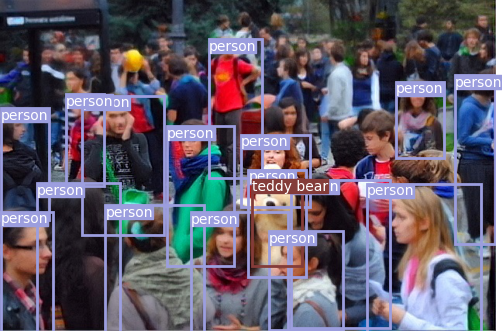
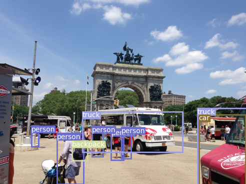
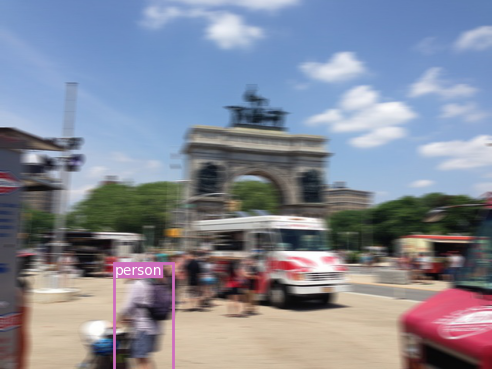
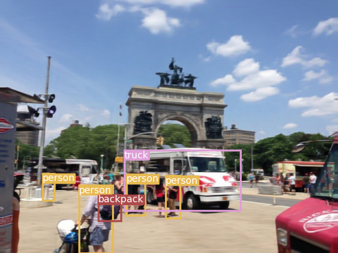
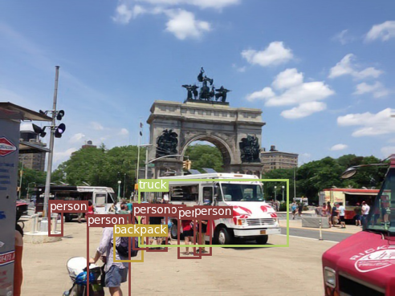
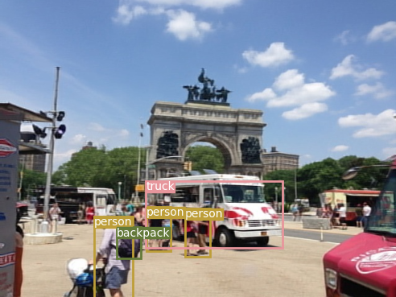
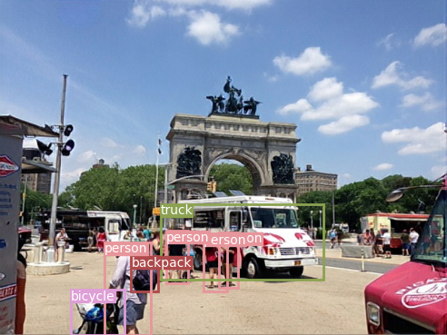

# Deblur-YOLO
This is the official Pytorch implementation for our paper:

"Deblur-YOLO: Real-Time Object Detection with Efficient Blind Motion Deblurring"   [[Paper Link](https://ieeexplore.ieee.org/document/9534352)]

# Abstract
Object detection has been a traditional yet open computer vision research field. In intensive studies, object detection models have achieved promising results regarding recognition accuracy and inference speed. However, previous state-of-the-art algorithms fail to operate at blurry images. In this work, we propose Deblur-YOLO, an efficient, YOLO-based and detection-driven approach robust to motion blur photographs. We introduce a generative adversarial network with a dilated feature pyramid generator, a pair of multi-scale discriminators with spectral normalization, and a detection discriminator. We design a new image quality metric called Smooth Peak Signal-to-Noise Ratio (SPSNR) for measuring the smoothness of the reconstructed image. Empirical studies on benchmark datasets demonstrate Deblur-YOLO's superiority. On COCO 2014, Set 5 and Setl4, Deblur-YOLO achieves leading results for parameters, deblurring time, PSNR, SPSNR and SSIM. We also visually display the excellence of our deblurring performance to competing models.

# Visual Comparisons

## Toy Visual Comparison 
From left to right: the object detection result on blurry image, blurry image restored by Deblur-YOLO, and the groundtruth image. 

<p float="left">
<p align="middle">
  
   
  
</p>

## Visual Comparison on Blurred COCO 2014
From top left to bottom right: the object detection result on Clean Image, Blurred Image, DeepDeblur, SRN Deblur, DynamicDeblur, DeblurGANv2(I-R), DeblurGANv2(M), Deblur-YOLO

<p float="left">
<p align="middle">
  
   
  
  
   
  
   
  
</p>

# Model Architecture
Click the links below to see the model architecture


# Prerequisite

- Windows or Linux 
- CUDA 10.0+
- Python 3
- Pytorch 1.0+ 
- torchvision 
- torchsummary
- opencv-python
- numpy
- albumentations
- scikit-image
- glog
- fire


# Dataset

# Training

# Testing

# Citation
```
@inproceedings{zheng2021deblur,
  title={Deblur-YOLO: Real-Time Object Detection with Efficient Blind Motion Deblurring},
  author={Zheng, Shen and Wu, Yuxiong and Jiang, Shiyu and Lu, Changjie and Gupta, Gaurav},
  booktitle={2021 International Joint Conference on Neural Networks (IJCNN)},
  pages={1--8},
  year={2021},
  organization={IEEE}
}
```

# TODO List
- [x] Add Dependencies
- [x] Upload Model Architecture Figure
- [x] Upload Visual Comparisons
- [ ] List important hyperparameters
- [ ] Upload Training Dataset
- [ ] Upload Testing Dataset
- [ ] Update Code 
- [ ] Testing on Video
- [ ] Upload Pretrained Weight 
- [ ] Finalize readme


# Acknowledgement
This code is heavily based upon [DeblurGANv2](https://github.com/VITA-Group/DeblurGANv2). We thanks the authors for sharing their code. 

